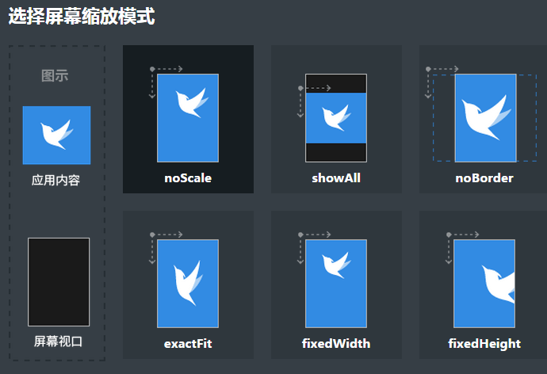
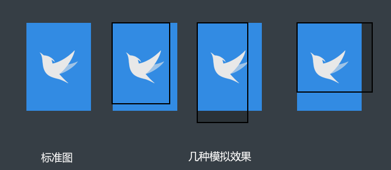
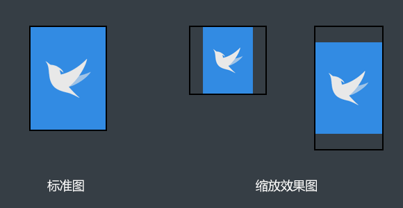
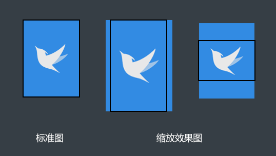
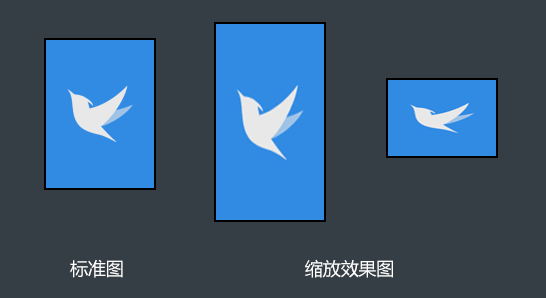
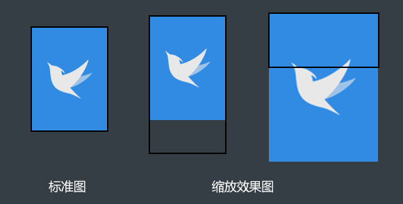
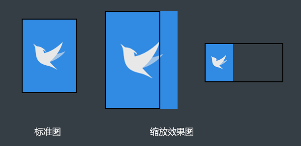
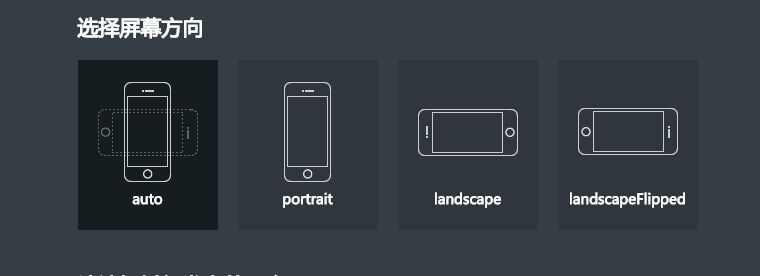
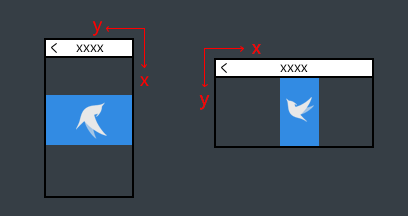

# egret 2.4版本缩放模式和旋转模式说明

引擎在更新到2.4版本后，有6种屏幕缩放模式。有新增的，也有改变的(比如noBorder模式)。下面我们详细说一下它们的区别和效果。

新版缩放模式在创建项目的时候可以很方便的选择，非常直观。



您也可以在创建好的项目里随时修改，具体的位置是 index.html 里的 body 部分，如下所示

```
<body>
    <div
        data-scale-mode="noScale" >
    </div>
</body>
```
你还可以在项目代码里随时修改
~~~
this.stage.scaleMode = egret.StageScaleMode.FIXED_WIDTH;
~~~

## noScale 模式



上面是 noScale 模式的效果图，最左侧是标准的图片，右侧是模拟3种不同屏幕下的显示效果。

noScale 模式顾名思义，就是不对内容进行任何缩放，保持原始的1:1比例，然后直接把舞台对齐到浏览器的左上角。即使在更改播放器窗口大小时，它仍然保持不变。如果播放器窗口比内容小，则可能进行一些裁切。在此模式下，舞台尺寸（stage.stageWidth,stage.stageHeight）始终跟播放器窗口大小保持一致。

## showAll 模式



上面是 showAll 模式的效果图，最左侧是标准的图片，右侧是模拟2种不同屏幕下的显示效果。

showAll 模式就是保持宽高比，显示全部内容。缩放后应用程序内容向较宽方向填满播放器窗口，另一个方向的两侧可能会不够宽而留有黑边。在此模式下，舞台尺寸(stage.stageWidth,stage.stageHeight)始终等于初始化时外部传入的应用程序内容尺寸。

目前的手机屏幕大部分都是16:9的，所以指定一个设计宽高尺寸，就可以在大部分移动设备有相接近的体验，这时使用 showAll 模式是一个比较简单的适配模式。

## noBorder 模式


上面是 noBorder 模式的效果图，最左侧是标准的图片，右侧是模拟2种不同屏幕下的显示效果。

noBorder 和之前版本的缩放模式是不一样的，原来的 noBorder 模式现在叫 fixedWidth ，后面会有说明。

noBorder 模式会根据屏幕的尺寸等比缩放内容，缩放后应用程序内容向较窄方向填满播放器窗口，不会有黑边存在，另一个方向的两侧可能会超出播放器窗口而被裁切，只显示中间的部分。

在此模式下，舞台尺寸(stage.stageWidth,stage.stageHeight)始终等于初始化时外部传入的应用程序内容尺寸。

## exactFit 模式


上面是 exactFit 模式的效果图，最左侧是标准的图片，右侧是模拟2种不同屏幕下的显示效果。

exactFit 模式是不保持原始宽高比缩放应用程序内容，缩放后应用程序内容正好填满播放器窗口。简单的说就是不按照原来内容的比例，直接拉伸，暴力填充整个屏幕。在此模式下，舞台尺寸(stage.stageWidth,stage.stageHeight)始终等于初始化时外部传入的应用程序内容尺寸。

## fixedWidth 模式


上面是 fixedWidth 模式的效果图，最左侧是标准的图片，右侧是模拟2种不同屏幕下的显示效果。

fixedWidth 模式是保持原始宽高比缩放应用程序内容，缩放后应用程序内容在水平和垂直方向都填满播放器窗口，但只保持应用程序内容的原始宽度不变，高度可能会改变。在此模式下，舞台宽度(stage.stageWidth)始终等于初始化时外部传入的应用程序内容宽度。舞台高度(stage.stageHeight)由当前的缩放比例与播放器窗口高度决定。

fixedWidth 就是老版本中的 noBorder 模式，是一般做游戏推荐的模式。宽度固定了，高度随屏幕自适应，可以获得最好的显示效果。

## fixedHeight 模式


上面是 fixedHeight 模式的效果图，最左侧是标准的图片，右侧是模拟2种不同屏幕下的显示效果。

fixedHeight 模式保持原始宽高比缩放应用程序内容，缩放后应用程序内容在水平和垂直方向都填满播放器窗口，但只保持应用程序内容的原始高度不变，宽度可能会改变。在此模式下，舞台高度(stage.stageHeight)始终等于初始化时外部传入的应用程序内容高度。舞台宽度(stage.stageWidth)由当前的缩放比例与播放器窗口宽度决定。

fixedHeight 是新增的一种缩放模式，和 fixedWidth 相反，高度固定，宽度随屏幕自适应。

# 旋转模式
通过设置旋转模式，可以在浏览器因为重力感应发生旋转的时候，让内容根据你的要求随着变化。

新版旋转模式在创建项目的时候可以很方便的选择，非常直观。



和缩放模式一样，您也可以在 index.html 里的 body 部分修改，如下所示

```
<body>
    <div
        data-orientation="auto" >
    </div>
</body>
```
你还可以在项目代码里随时修改
~~~
this.stage.orientation = egret.OrientationMode.AUTO;
~~~

旋转模式目前有4种，下面我们就详细的说一下。
### 效果图的缩放模式均为 showAll
## auto 模式


auto 模式很容易理解，不管横屏还是竖屏，都是从上到下的显示内容。

## portrait 模式

portrait 模式是始终以竖屏状态下手机的左上角为起点显示内容

## landscape 模式

landscape 和 portrait 类似，是始终以竖屏状态下手机的右上角为起点显示内容。

## landscapeFlipped 模式

landscapeFlipped 模式比较特殊，横屏状态下和 landscape 起点相同，竖屏状态下起点位置和 landscape 相反，从右上方变成了左下方。

landscape 和 landscapeFlipped 这两种模式，一般用于横屏游戏，但需要提示用户关闭重力感应锁，锁定屏幕方向。简单说就是竖屏状态下玩横屏游戏。