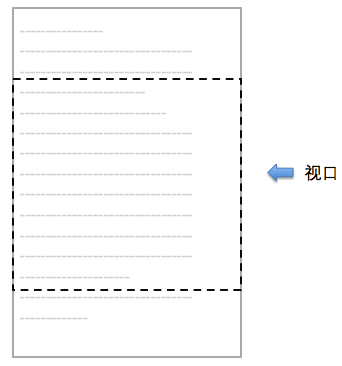
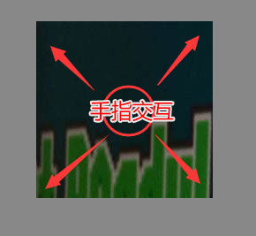

#Swan (UI库) 编程指南 - 滚动控制容器

屏幕的尺寸总是有限的，当您的内容已经超出屏幕的范围，该如何处理呢？在 PC 上浏览网页的时候，我们是如何看到屏幕显示不下的那些内容呢？没错，用滚动条。通过拉动滚动条，我们就能一点一点的看完整个网页。这里就引入了一个概念：视口(ViewPort)，如下图所示：



可以这样理解：视口就是您的显示器，内容可以在视口中滚动，这样您就可以看到本来是隐藏的那些部分。在 PC上，我们用滚动条来控制内容滚动，在手机上就比较特殊了，我们是用手指的滑动，实现滚动条类似的效果。对于移动设备的浏览器来说，"滚动"是内置的功能，一个网页不需要特殊设置就能使用这个功能。但对 Egret 来说，"滚动"却是需要自己实现的，因为 Egret 一般情况下要禁用浏览器的滚动，以免对交互造成干扰。对于在Canvas上绘制的内容，"滚动"是需要自己去"虚拟实现"的。

好在 eui 中已经提供了一个组件，就是 Scroller。您只需要创建一个 Scroller 的实例，设置位置和尺寸，然后把需要"滚动"的那个容器，设置到 Scroller 的 viewport 属性上就可以了。

下面的示例中我们使用了一张比较大的图片，手机屏幕是显示不下的，然后我们看看如何交给Scroller来处理：

``` TypeScript
class ScrollerDemo extends eui.Group {
    constructor() {
        super();
    }
    protected createChildren() {
        super.createChildren();
        //创建一个容器，里面包含一张图片
        var group = new eui.Group();
        var img = new eui.Image("resource/bg.jpg");
        group.addChild(img);
        //创建一个Scroller
        var myScroller = new eui.Scroller();
        //注意位置和尺寸的设置是在Scroller上面，而不是容器上面
        myScroller.width = 200;
        myScroller.height = 200;
        //设置viewport
        myScroller.viewport = group;
        this.addChild(myScroller);
    }
}

```
> 注意位置和尺寸的约束应该是在Scroller上面，而不是容器上面，这是新手容易犯的错误，需要注意

实现效果：



### 定位滚动位置
除了通过手指控制 Scroller , 我们通过代码也可以获取和控制滚动的位置
``` 
Scroller.viewport.scrollV  纵向滚动的位置
Scroller.viewport.scrollH  横向滚动的位置
``` 
改变这2个值，就可以改变滚动的位置。
下面是一个滚动的示例，初始化以后就会改变 Scroller 里列表的位置，点击按钮也会移动列表。
~~~ TypeScript
class ScrollerPosition extends eui.UILayer {
    private scroller: eui.Scroller;
    constructor() {
        super();
        //创建一个列表
        var list = new eui.List();
        list.dataProvider = new eui.ArrayCollection([1, 2, 3, 4, 5]);
		//创建一个 Scroller
        var scroller = new eui.Scroller();
        scroller.height = 160;
        scroller.viewport = list;
        this.addChild(scroller);
        this.scroller = scroller;
		//创建一个按钮，点击后改变 Scroller 滚动的位置
        var btn = new eui.Button();
        btn.x = 200;
        this.addChild(btn);
        btn.addEventListener(egret.TouchEvent.TOUCH_TAP,this.moveScroller,this);
    }
    protected createChildren() {
    	//初始化后改变滚动的位置
        this.scroller.viewport.validateNow();
        this.scroller.viewport.scrollV = 40;
    }
    private moveScroller():void{
    	//点击按钮后改变滚动的位置
        var sc = this.scroller;
        sc.viewport.scrollV += 10;
        if ((sc.viewport.scrollV + sc.height) >= sc.viewport.contentHeight) {
          console.log("滚动到底部了");
        }
    }
}
~~~
上面代码最后一段可以计算是否滚动到列表的底部
~~~
Scroller.viewport.scrollV 是滚动的距离，这个值是变化的
Scroller.height 是滚动区域的高度，这个值是固定的
Scroller.viewport.contentHeight 是滚动内容的高度，这个值是固定的
~~~
通过计算这3个值，就可以判断是否滚动到顶部或者底部了

